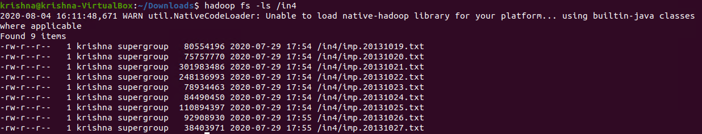
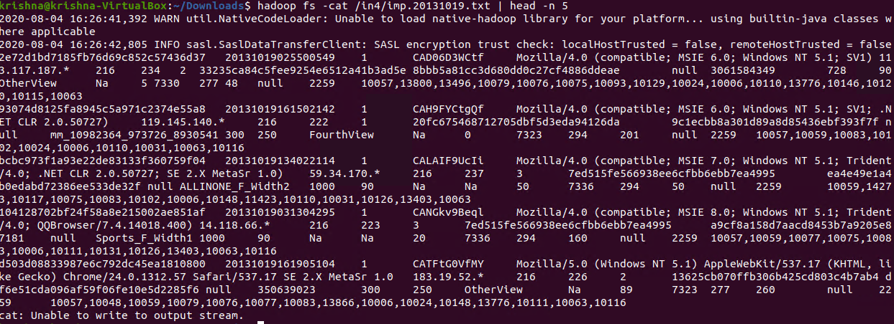
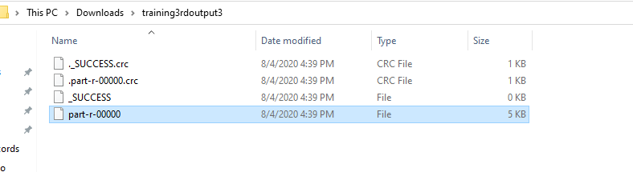
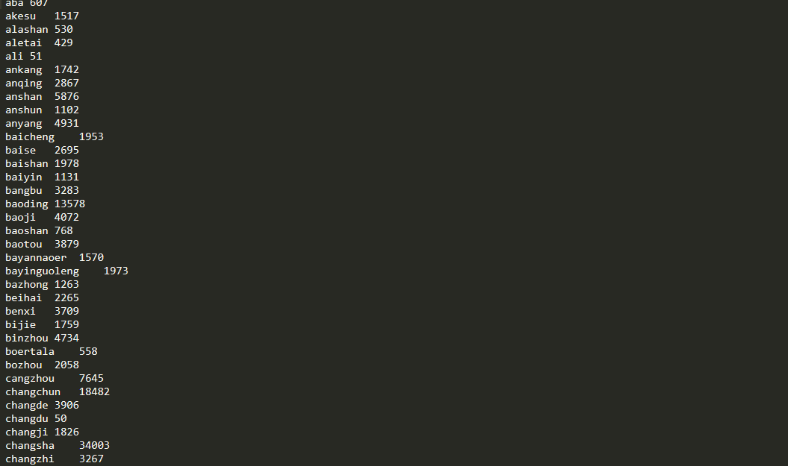
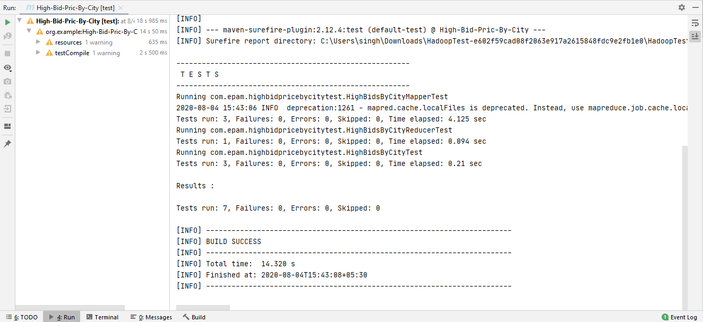

# Mapreduce High BID Priced **(more than 250)** impression events by city
-----------------------

## MapReduce

* Data processing layer in Hadoop. 
* Processing structured & Unstructured Data in Hadoop.

## Pros

* Best Performance 

## Cons 

* Hard to Extend 
* Lack of management tools
* Not suitable for real time processing
* very small community

## Input Directory

Input directory contains input files that will be processed by MapReduce to calculate amount of high-bid-priced  **(more than 250)** impression events by city. 

  

In the above screenshot, we can see an input directory contains 9 input files:
1.	imp.20131019.txt
2.	imp.20131020.txt
3.	imp.20131021.txt
4.	imp.20131022.txt
5.	imp.20131023.txt
6.	imp.20131024.txt
7.	imp.20131025.txt
8.	imp.20131026.txt
9.	imp.20131027.txt  

## imp.20131019.txt
 
  
 
In the above screenshot, we can see the content of the imp.20131019.txt input file.  

## Output Directory

Output directory will be automatically created contains output files.
 
  

## Read output file Content:

  
 
In the above screenshot, we can see the output contains key – represent the name of the city & value – maximum impressions.  

## Test Cases:

  
 
In the above screenshot, we can see that all 7 test cases have passed.  

**Created by:**  
**Name: Krishna Kumar Singh**  
**Email: krishnaai265@gmail.com**  
**Phone: +91-9368754996** 
